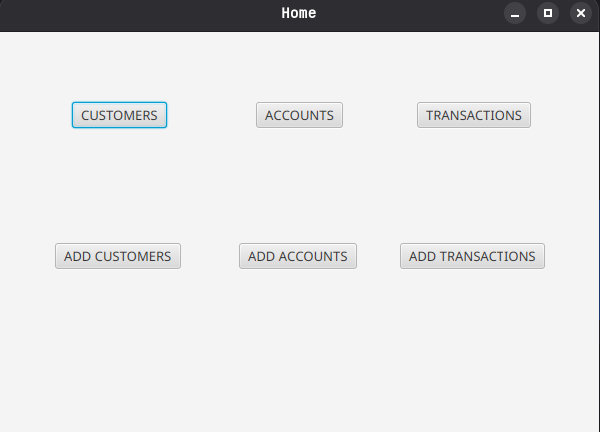
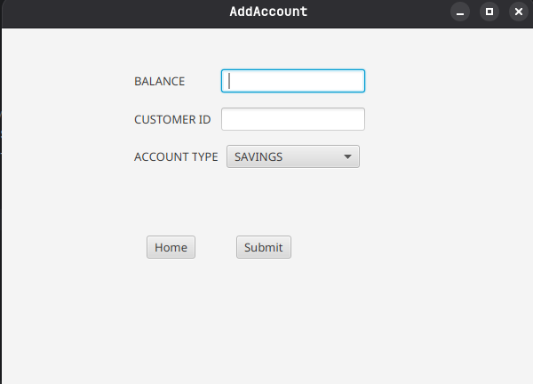
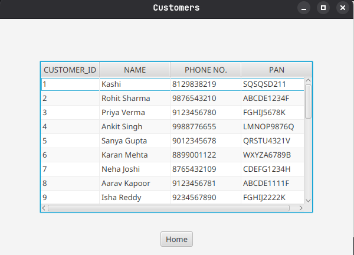

# Guvi Banking System

A comprehensive banking application developed in Java, designed to simulate real-world banking operations such as account creation, deposits, withdrawals, and transaction history management.

---

## 🧠 Project Overview

This Banking System is a  application that emulates essential banking functionalities. It provides a user-friendly interface for managing bank accounts and performing transactions, making it an ideal project for understanding object-oriented programming concepts and Java development.

---

## ⚙️ Features

* **Account Management**: Create and manage multiple bank accounts.
* **Transactions**: Deposit and withdraw funds with real-time balance updates.
* **Transaction History**: View detailed transaction reports.

---

## 🛠️ Technologies Used

* **Programming Language**: Java
* **Development Environment**: IntelliJ IDEA
* **Build Tool**: Maven

---

## 📁 Project Structure

The project follows a modular structure for maintainability and scalability:

```
Guvi_Banking_system/
├── .mvn/
│   └── wrapper/
├── src/
│   └── main/
│       └── java/
│           └── com/
│               └── guvi/
│                   └── banking/
│                       ├── Account.java
│                       ├── Transaction.java
│                       └── BankSystem.java
├── .gitignore
├── mvnw
├── mvnw.cmd
└── pom.xml
```
## HOME SCREEN



---
## CREATE SCREEN



---
## Retrievel SCREEN



---
